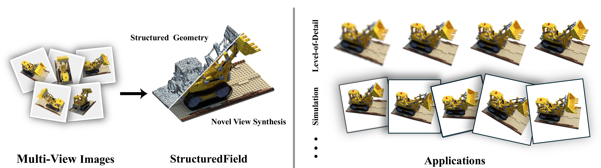

# StructuredField: Unifying Structured Geometry and Radiance Field

Official implementation of StructuredField: Unifying Structured Geometry and Radiance Field

| [Project Page](https://structuredfield.github.io/) | [ArXiv](https://arxiv.org/abs/2501.18152) |



## Abstract

Recent point-based differentiable rendering techniques have achieved significant success in high-fidelity reconstruction and fast rendering. However, due to the unstructured nature of point-based representations, they are difficult to apply to modern graphics pipelines designed for structured meshes, as well as to a variety of simulation and editing algorithms that work well with structured mesh representations. To this end, we propose StructuredField, a novel representation that achieves both a structured geometric representation of the reconstructed object and a high-fidelity rendering reconstruction of the object. We employ structured tetrahedral meshes to represent the reconstructed object. We reparameterize the geometric attributes of these tetrahedra into the parameters of 3D Gaussian primitives, thereby enabling differentiable, high-fidelity rendering directly from the mesh. Furthermore, a hierarchical implicit subdivision strategy is utilized to ensure a conformal mesh structure while empowering the representation to capture multi-scale details. To maintain geometric integrity during optimization, we propose a novel inversion-free homeomorphism that constrains the tetrahedral mesh, guaranteeing it remains both inversion-free and self-intersection-free during the optimization process and the final result. Based on our proposed StructuredField, we achieve high-quality structured meshes that are completely inversion-free and conformal, while also attaining reconstruction results comparable to those of 3DGS. We also demonstrate the applicability of our representation to various applications such as physical simulation, deformation and level-of-detail.


## Installation

### Environment Setup

We recommend using conda to manage the environment:

```bash
# Clone repository with submodules
git clone --recursive https://github.com/your-org/StructuredField.git
cd StructuredField

# Create conda environment with PyTorch 2.0.1
conda create -n structured_field python=3.9
conda activate structured_field

# Install PyTorch and CUDA dependencies (use the correct version of cuda for your system)
conda install cudatoolkit=11.8 pytorch==2.0.1 torchvision=0.15.2 torchtriton=2.0.0 -c pytorch -c nvidia

# Install additional requirements
pip install -r requirements.txt
```

### Build Dependencies

#### Install Custom CUDA Extensions
```bash
# Install core packages
pip install -e submodules/diff-gaussian-rasterization/
pip install -e submodules/simple-knn/
```

## Training

### 1. Dataset Preparation

Prepare your dataset in COLMAP or NeRF Synthetic format:
```
<dataset_path>
├── images/
│   ├── img_001.jpg
│   ├── img_002.jpg
│   └── ...
└── sparse/
    └── 0/
        ├── cameras.bin
        ├── images.bin
        └── points3D.bin
```

### 2. Training with Initialization

For best results, we recommend initializing with tetrahedral meshes. The workflow is:
1. Extract surface mesh using [NeuS2](https://github.com/19reborn/NeuS2/)
2. Tetrahedralize using [fTetWild](https://github.com/wildmeshing/fTetWild)
3. Train StructuredField with the tetrahedral mesh

For convenience and reproduction, we provide pre-computed initial meshes for NeRF Synthetic dataset:

**Download Link**: [Google Drive]([https://drive.google.com/drive/folders/YOUR_FOLDER_ID](https://drive.google.com/drive/folders/1ojsiu5HVeb6nz1Wj-Lite34avnJ6_ktW?usp=share_link))

Download and place the meshes in the `data` folder:

```bash
# Download the meshes and extract to data folder
# The data folder should contain:
# data/
# ├── chair/
# │   └── points3d.msh
# ├── drums/
# │   └── points3d.msh
# ├── ficus/
# │   └── points3d.msh
# └── ... (other scenes)

# Train with pre-computed tetrahedral mesh
python train_tet.py -s data/<scene_name> -m <output_model_path> \
    --max_depth 5
```

### 3. Training without Initialization

For training from scratch without initialization, you could remove points3d.msh in `/path/to/data`, which will automatically generate initial tetrahedral mesh:

```bash
# Remove existing tetrahedral mesh (if any) to trigger automatic generation
rm -f <path_to_dataset>/points3d.msh

# Train structured field
python train_tet.py -s <path_to_dataset> -m <output_model_path> 

```

### 4. Training Parameters

Key training parameters for StructuredField:

- `--max_depth`: Maximum subdivision depth for hierarchical tetrahedra (default: 5)
- `--lambda_quality`: Tetrahedral quality regularization (default: 10.0)
- `--iterations`: Total training iterations (default: 30000)


## Exporting Mesh

After training, export the final structured mesh:

```bash
python save_ckpt_mesh.py -m <path_to_trained_model> \
    --iteration <checkpoint_iteration> \
    --output_path <output_mesh_path>
```

This will generate:
- `output_mesh.msh`: Final tetrahedral mesh in MSH format


## Physcial Simulation and Deformation


## Citation

If you find our work useful, please cite:

```bibtex
@article{song2025structuredfield,
  title={StructuredField: Unifying Structured Geometry and Radiance Field},
  author={Song, Kaiwen and Cui, Jinkai and Qiu, Zherui and Zhang, Juyong},
  journal={arXiv preprint arXiv:2501.18152},
  year={2025}
}
```

## License

This project is licensed under the terms of the LICENSE.md file. This software is free for non-commercial, research and evaluation use.

## Acknowledgments

This work is built upon [3D Gaussian Splatting](https://github.com/graphdeco-inria/gaussian-splatting). We thank the authors for their excellent work and open-source code.

## Contact

For questions and inquiries, please open an issue or contact [kevinsong2000@mail.ustc.edu.cn].
